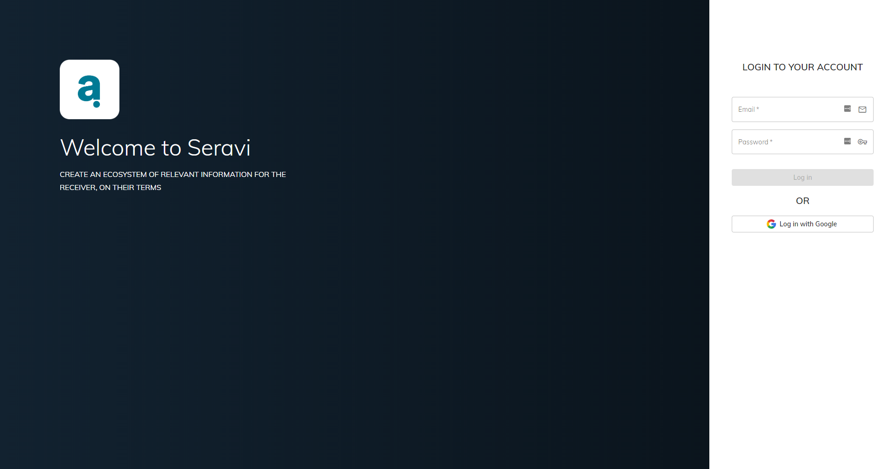
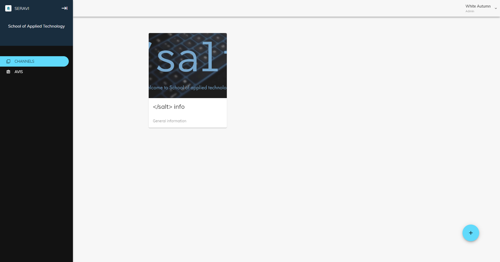
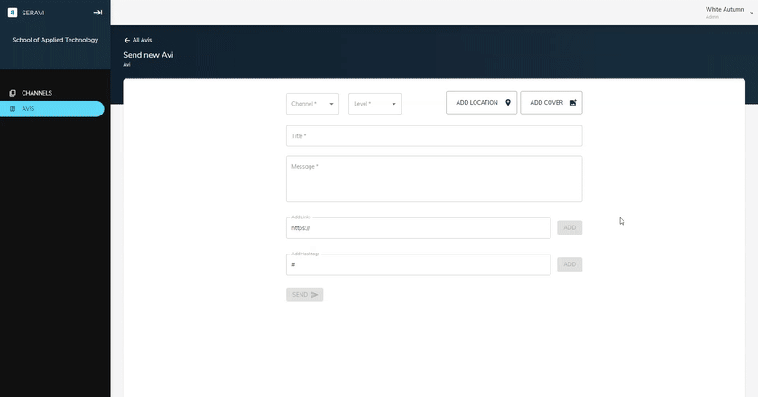

# Seravi Webportal
A webportal for the company Seravi that allows organisations to post important news and information to their end-users.

## Overview
Seravi is a company that let companies and organisations spread important announcements/messages/news to their subscribers. Our assignment was to build a webportal which allowed the companies and organisations compose a message that was sent to the end-user whom was notified on the Seravi app.

## Specifications
Our main goal of the project was to make a functioning message creation page which allowed the admin-user to compose their message with details such as: title, message, map position, hashtags, website, level of importance etc. A secondary goal was to aestethically enhance the webportal when it came to the different channel page and in general.

## Techstack
* Node.js
* React.js
  * Material UI
  * FUSE
* MongoDB
* Firebase
* AWS

### Demo

